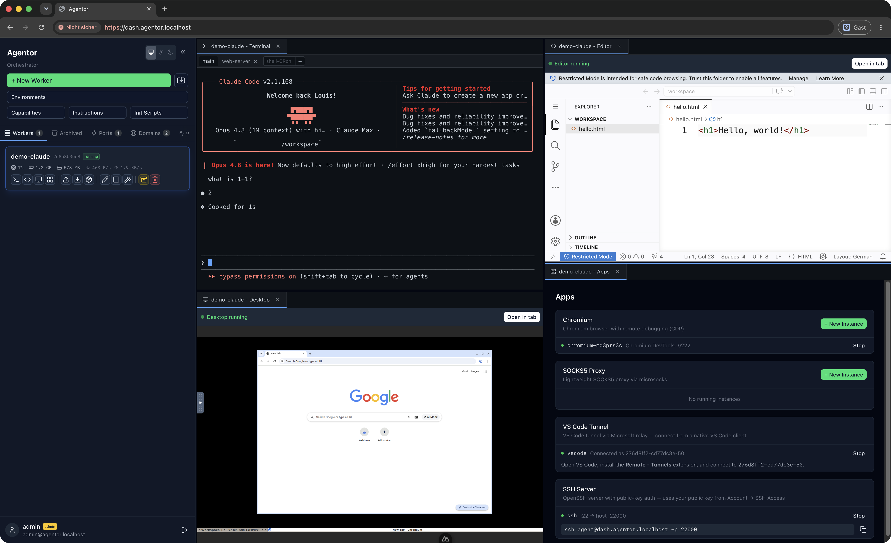

# Agentor

[](https://github.com/lonetis/agentor/actions/workflows/docker-build.yml)

Self-hosted alternative to Claude Code Web, Codex in the Cloud, and similar managed agent environments — with full control over the runtime environment. Spawns isolated AI coding agent workers in Docker containers, each with terminal access, a virtual desktop, port forwarding, and optional git repo cloning, all managed through a web dashboard.



## Pre-installed Agents

All agents are installed in a single unified worker image. Start any agent via init script presets or manually in the terminal.

| Agent | | OAuth Login (in worker) | API Key (in `.env`) |
|-------|---|------------------------|---------------------|
| **Claude** | [anthropics/claude-code](https://github.com/anthropics/claude-code) | `claude` → `/login` | `ANTHROPIC_API_KEY` |
| **Codex** | [openai/codex](https://github.com/openai/codex) | `codex login --device-auth` | `OPENAI_API_KEY` |
| **Gemini** | [google-gemini/gemini-cli](https://github.com/google-gemini/gemini-cli) | `gemini` → `/auth` | `GEMINI_API_KEY` |

## Features

- **Live terminal** — xterm.js WebSocket terminal with tmux session management
- **VS Code editor** — code-server (VS Code in the browser) per worker, accessible in a split pane
- **Virtual desktop** — Xvfb + fluxbox + noVNC, accessible in-browser
- **Multi-repo cloning** — clone one or more git repos into each worker at startup
- **App system** — launch Chromium (with CDP) or SOCKS5 proxy instances inside workers
- **Port mapper** — dedicated container running TCP reverse proxies to expose worker-internal ports to the host
- **Domain mapping** — Traefik reverse proxy with TLS (Let's Encrypt HTTP-01/DNS-01 or self-signed CA), subdomain-based routing to worker ports, optional HTTP basic auth
- **Auto-updates** — per-image or bulk image updates in production mode with registry-agnostic digest comparison (GHCR + Docker Hub), orchestrator self-replaces
- **Resource limits** — per-worker CPU and memory constraints
- **Volume mounts** — bind-mount host directories into workers
- **Persistent workspaces** — workspace data survives container stops, restarts, and archiving via named Docker volumes
- **Worker archiving** — archive workers to free resources while preserving workspace data; unarchive to restore
- **File upload/download** — upload files/folders to running workers or during creation, download workspace as `.tar.gz`
- **Docker-in-Docker** — opt-in per-environment, full Docker daemon inside workers (build, run, compose)
- **Usage monitoring** — real-time usage/rate limit indicators for OAuth-authenticated agents (Claude, Codex, Gemini)
- **Centralized logging** — collects logs from all containers (orchestrator, workers, mapper, traefik) with NDJSON storage, log rotation, and a live-streaming log viewer in the dashboard
- **Theme toggle** — switch between system default, light, and dark mode
- **API docs** — auto-generated OpenAPI 3.1.0 spec with interactive Scalar UI at `/api/docs`

---

## Quick Start

No need to clone the repo — all images are pulled from GHCR.

```bash
curl -fsSL https://raw.githubusercontent.com/lonetis/agentor/main/install.sh | bash
```

This downloads `docker-compose.yml`, `.env`, and `.cred/` template files into the current directory. Then:

1. Edit `.env` with your API keys (see [`.env.example`](.env.example)) — for OAuth auth, log in once inside a worker instead (see [`.cred.example/README`](.cred.example/README))
2. `docker compose up -d`
3. Open **http://localhost:3000**

---

## Getting Started (from source)

### Prerequisites

- Docker Engine 24+ with Compose v2

### Configure

1. Copy the example files:

   ```bash
   cp .env.example .env
   cp -r .cred.example .cred
   ```

2. Edit `.env` — everything works out of the box with defaults, but see [`.env.example`](.env.example) for all available options. For OAuth/subscription authentication, start a worker and log in once — credentials are shared across all workers automatically (see [`.cred.example/README`](.cred.example/README)).

---

### Development

Development mode mounts the orchestrator source code into the container with hot reload.

1. **Build images locally:**

   ```bash
   docker build -t agentor-mapper:latest ./mapper
   docker build -t agentor-worker:latest ./worker
   ```

2. **Start the dev server:**

   ```bash
   docker compose -f docker-compose.dev.yml up
   ```

3. Open **http://localhost:3000**

---

### Production

Production mode uses pre-built images from GHCR — no local builds needed.

```bash
docker compose -f docker-compose.prod.yml up -d
```

Open **http://localhost:3000**

> [!NOTE]
> The production compose file sets `WORKER_IMAGE_PREFIX=ghcr.io/lonetis/` so the orchestrator pulls worker images from GHCR automatically. Docker will pull images on first container creation.

> [!NOTE]
> The port mapper runs as a separate container (`agentor-mapper`) managed automatically by the orchestrator. It is created when the first port mapping is added and removed when all mappings are deleted. Mapped ports are arbitrary — no fixed ranges.

---

## Storage

By default, all persistent data lives in `./data/` on the host — easy to browse, back up, and migrate. To use a Docker named volume instead, change the `/data` mount in your compose file:

```yaml
# Directory mode (default):
- ./data:/data

# Volume mode:
- agentor-data:/data
```

The storage mode is auto-detected from the mount type — no env var changes needed. In directory mode, worker workspaces live at `./data/workspaces/` and can be accessed directly from the host.

## Ports

| Port | Binding | Purpose |
|------|---------|---------|
| `3000` | `127.0.0.1` | Web dashboard (includes proxied desktop and editor access) |
| `80`, `443` | `0.0.0.0` | Traefik reverse proxy (only when `BASE_DOMAINS` is set) |
| _user-defined_ | `127.0.0.1` or `0.0.0.0` | Port mapper (localhost or external type) |

## License

MIT
